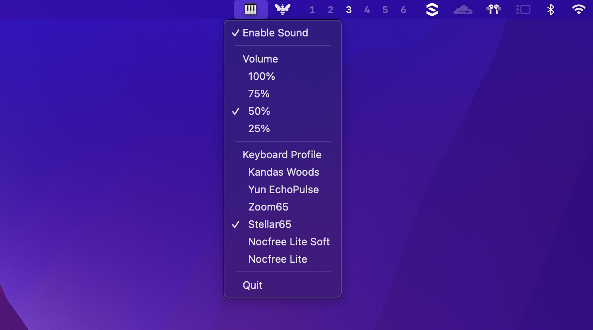

[](https://github.com/cesarferreira/clickclack/blob/main/LICENSE)
[](#)
[](https://crates.io/crates/clickclack)
[]()

# 🎹 ClickClack
> Ever wished your keyboard sounded as fancy as those $200 mechanical keyboards your coworkers won't shut up about? Well, wish no more! ClickClack brings that sweet, sweet mechanical keyboard ASMR to your fingertips without breaking the bank! 

<p align="center">
  
</p>

## ⚙️ Installation
macOS 10.15 or later (sorry Windows users, you'll have to stick to your rubber domes... for now)

```bash
cargo install clickclack
```

### Build From Source

See: [Build From Source](#%EF%B8%8F-build-from-source).

## 🎥 Demo

The video shows an example of what it sounds like (unmute).

https://github.com/user-attachments/assets/060fd77e-19e6-40e4-84b6-46dbd116acd0


## ⚙️ Configuration

Your settings are automatically saved in `~/.config/clickclack/config.toml`. Here's an example of what it looks like:

```toml
enabled = true
volume = 0.25
switch_type = "bluealps"
```

## Usage

Just run:
```bash
clickclack
```

### Service Management

ClickClack can be run as a system service that starts automatically when you log in. The following commands are available:

```bash
# Start the ClickClack service
clickclack start

# Stop the ClickClack service
clickclack stop

# Restart the ClickClack service
clickclack restart
```

The service will automatically start at login and run in the background. You can still access all settings through the menu bar icon.

## 🛠️ Build From Source

1. Clone this bad boy:
```bash
git clone https://github.com/cesarferreira/clickclack.git
cd clickclack
```

2. Build it like you mean it:
```bash
cargo build --release
```

3. Find your shiny new toy at `target/release/clickclack`

Look for the keyboard icon in your menu bar - that's your new best friend!

## 🎹 Supported Switches

Choose your perfect sound from our curated collection of premium mechanical switches:

- **Alpaca Linear** - Smooth linear switches known for their buttery typing experience
- **Gateron Black Ink V2** - Premium linear switches with a deep, satisfying sound profile
- **Alps Blue** - Vintage clicky switches from Alps Electric with a unique sharp tactility
- **Kailh BOX Navy** - Heavy clicky switches with a thick, crisp sound signature
- **IBM Buckling Spring** - Classic switches from Model M keyboards, the grandfather of mechanical keyboards
- **NovelKeys Cream** - Self-lubricating linear switches with a unique POM housing
- **Holy Panda** - Popular tactile switches born from a BSUN/Drop collaboration, known for their rounded tactile bump
- **Cherry MX Black** - Classic linear switches, the industry standard for decades
- **Cherry MX Blue** - Standard clicky switches with that iconic mechanical keyboard sound
- **Cherry MX Brown** - Light tactile switches perfect for typing and gaming
- **Gateron Red Ink V2** - Lighter version of Black Inks with a smooth, premium feel
- **Topre** - Electro-capacitive rubber dome switches with a unique "thock" sound
- **Turquoise Tealios** - Premium linear switches with a smooth, refined feel

## ✨ What's This Magic?

- 🎵 Real-time mechanical keyboard sounds that'll make your fingers dance
- 🎚️ Sound tweaks that would make an audio engineer jealous:
  - Volume control (from "library whisper" to "wake the neighbors")
  - Frequency adjustment (from "gentle butterfly" to "angry typewriter")
  - Decay rate (from "quick tap" to "dramatic echo")
- 🪶 Lightweight menu bar app that sits quietly in the corner (until you start typing!)
- ⚡️ Lightning-fast response time (because nobody likes delayed gratification)
- 🔒 Privacy-focused (we don't care what you're typing, we just make it sound awesome)


## 🔒 Privacy (Serious Business)

ClickClack is like a good friend - it listens only when you want it to and keeps no secrets. It:
- Doesn't log your keystrokes (we're not that kind of app)
- Doesn't care which keys you're pressing (type 'pizza' 100 times, we won't judge)
- Doesn't send any data anywhere (what happens on your keyboard, stays on your keyboard)

## ⚖️ License

MIT Licensed - because sharing is caring! See LICENSE file for the boring legal stuff.

## 🤝 Contributing

Got ideas? Found a bug? Want to make it even more awesome? Pull requests are like high-fives - always welcome! 

---

Made with ❤️ and lots of ⌨️ clicks! 
