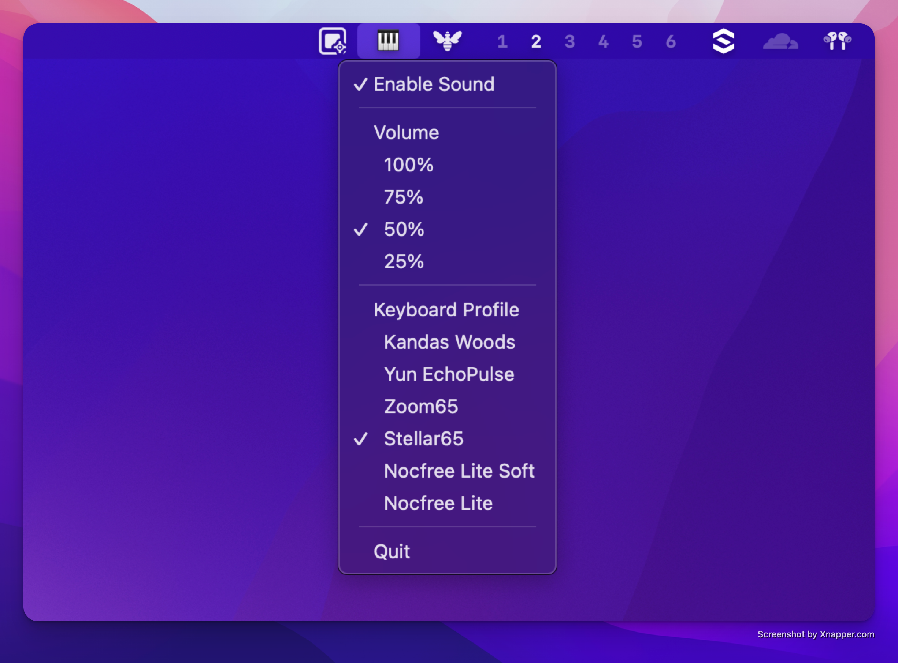

[](https://github.com/cesarferreira/clickclack/blob/main/LICENSE)
[](#)
[](https://crates.io/crates/clickclack)
[]()

# 🎹 ClickClack
> Turn Your Boring Keyboard into a Symphony of Satisfaction!

<p align="center">
  
</p>


Ever wished your keyboard sounded as fancy as those $200 mechanical keyboards your coworkers won't shut up about? Well, wish no more! ClickClack brings that sweet, sweet mechanical keyboard ASMR to your fingertips without breaking the bank! 

## ✨ What's This Magic?

- 🎵 Real-time mechanical keyboard sounds that'll make your fingers dance
- 🎚️ Sound tweaks that would make an audio engineer jealous:
  - Volume control (from "library whisper" to "wake the neighbors")
  - Frequency adjustment (from "gentle butterfly" to "angry typewriter")
  - Decay rate (from "quick tap" to "dramatic echo")
- 🪶 Lightweight menu bar app that sits quietly in the corner (until you start typing!)
- ⚡️ Lightning-fast response time (because nobody likes delayed gratification)
- 🔒 Privacy-focused (we don't care what you're typing, we just make it sound awesome)

## 🚀 Getting Started

### What You'll Need

- macOS 10.15 or later (sorry Windows users, you'll have to stick to your rubber domes... for now)
- Rust toolchain (if building from source, because we're fancy like that)

### Installation

```bash
cargo install clickclack
```

## Usage

Just run:
```bash
clickclack
```


### Building from Source

1. Clone this bad boy:
```bash
git clone https://github.com/cesarferreira/clickclack.git
cd clickclack
```

2. Build it like you mean it:
```bash
cargo build --release
```

3. Find your shiny new toy at `target/release/clickclack`


Look for the keyboard icon in your menu bar - that's your new best friend!

## 🎮 How to Use This Beast

1. Click the keyboard icon (it doesn't bite)
2. Choose your destiny:
   - Toggle sounds on/off (for when you need to be sneaky)
   - Adjust volume (from "I can hear myself think" to "MAXIMUM CLICKY")
   - Pick your frequency (from "sophisticated professional" to "mad typist")
   - Set the decay (from "quick and snappy" to "echoes of eternity")
3. Type away and feel like a keyboard warrior!

## 🎨 Sound Science (for the Nerds)

We've crafted these sounds using:
- Precisely tuned frequencies (math!)
- Harmonic overtones (more math!)
- Just the right amount of noise (controlled chaos!)
- Customizable decay (even more math!)

## 🔒 Privacy (Serious Business)

ClickClack is like a good friend - it listens only when you want it to and keeps no secrets. It:
- Doesn't log your keystrokes (we're not that kind of app)
- Doesn't care which keys you're pressing (type 'pizza' 100 times, we won't judge)
- Doesn't send any data anywhere (what happens on your keyboard, stays on your keyboard)

## ⚖️ License

MIT Licensed - because sharing is caring! See LICENSE file for the boring legal stuff.

## 🤝 Contributing

Got ideas? Found a bug? Want to make it even more awesome? Pull requests are like high-fives - always welcome! 

---

Made with ❤️ and lots of ⌨️ clicks! 